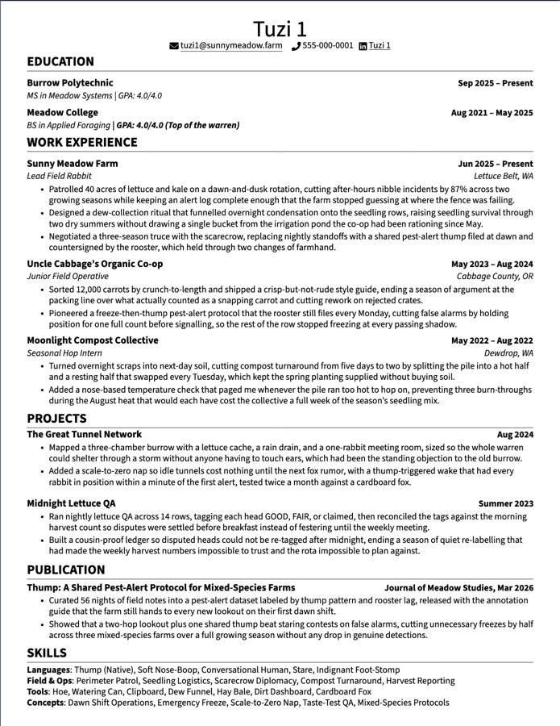
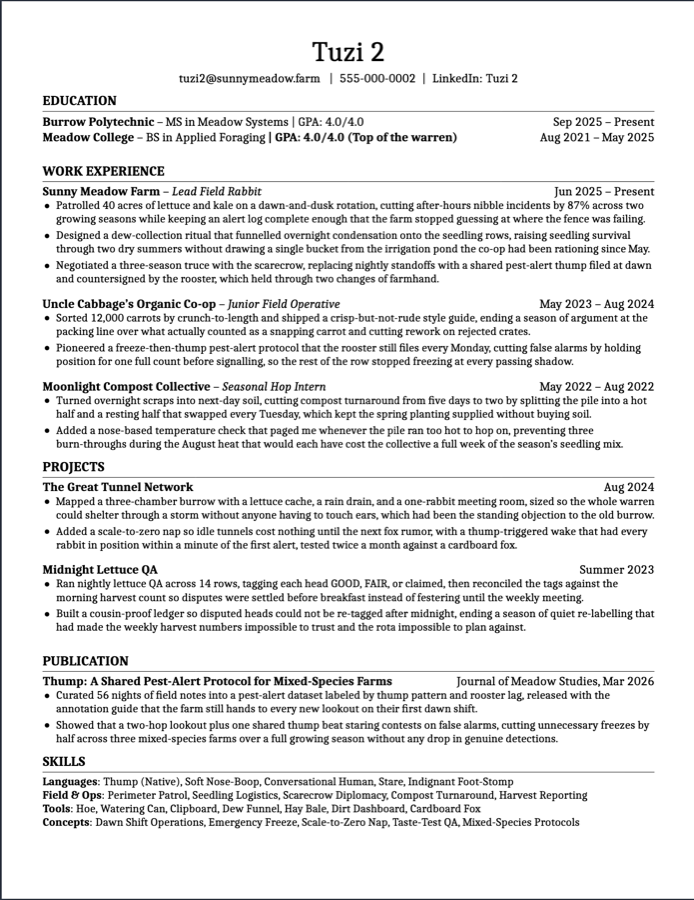

# resume-versioning

[English](README.md) · **简体中文**

一个 Claude Code skill，用于管理需要产出多份文档的 LaTeX 简历仓库。

## 问题

你有一份简历。然后你需要换个名字、配另一个邮箱再来一份。然后要一份投这类岗位、
一份投那类岗位。然后有人告诉你另一套排版效果更好，你想给其中一份换上。

最省事的做法是复制文件再改。这么干两次，你就有了四份文档，其中 90% 的文字是重复的，
而且分不清哪一份才是最新措辞。它们会漂移：某个数字在一份里更新了、其他几份没有；
一个早就作废的夸大数字，还留在你忘掉的那份文件里。

这个 skill 让措辞只存在一处。

## 效果

同一份 `content/` 文件，两种渲染方式。下面两份的**文字一个字都不差**，
不同的只有模板和字体。

| `classic` + `sourcesans` | `engineering` + `caladea` |
|---|---|
|  |  |

换模板或换字体，都只是驱动文件里的一行。措辞只有一份。

<sub>在 Overleaf 上渲染。内容为虚构。</sub>

## 结构

每份简历都是一次**选择**，而不是一次复制：

```
profiles/<人>.tex  ×  templates/<排版>.tex  ×  content/<岗位方向>.tex
                   ×  \ResumeFont
```

| 目录 | 存放 | 每个文件对应 |
|---|---|---|
| `profiles/` | 姓名、邮箱、电话、链接 | 一个身份 |
| `templates/` | 全部排版，实现一套共享命令接口 | 一种视觉风格 |
| `content/` | 只有措辞，零排版标记 | 一个岗位方向 |
| `fonts/` | 字体选择，可选 | 一种字体 |
| 驱动文件 | 以上各项的组合，加开关 | 一份成品简历 |
| `CONTENT_LIBRARY/` | 归档与候选措辞，Markdown 格式 | 一个主题 |

一个驱动文件大约十二行：

```latex
\documentclass[letterpaper,11pt]{article}

\newcommand{\ResumeFont}{carlito}

\input{profiles/example.tex}
\input{templates/classic.tex}

\begin{document}
\ResumeHeader
\input{content/example-role.tex}
\end{document}
```

加一个人，是一个文件。加一个岗位方向，是一个文件。加一套排版，则需要实现
[references/INTERFACE.md](references/INTERFACE.md) 里的命令接口 ——
实现之后，**现有的每一份简历**都能用它渲染。

## 安装

```bash
git clone <本仓库> ~/.claude/skills/resume-versioning
```

Claude Code 会自动识别。让它初始化简历仓库、加一个变体、或改一条 bullet，
它就会遵循这里的约定。

不用 Claude 直接搭脚手架：

```bash
~/.claude/skills/resume-versioning/scripts/init.sh ~/my-resume
```

### 可选：`log-app` 配套 skill

`log-app/` 是同仓库里的第二个独立 skill，用来记录**哪一份渲染出来的简历投给了哪家公司**。
和主 skill 一起装：

```bash
ln -s ~/.claude/skills/resume-versioning/log-app ~/.claude/skills/log-app
```

之后用 `/log-app <sha> <driver> "<职位标题>"` 触发。它会验证 SHA 和 driver
在你的简历仓库里存在，然后往本地 CSV
（默认 `~/Documents/RESUME/applications.csv`，可用 `RESUME_APPLICATIONS_CSV` 覆盖）
追加一行。简历仓库路径默认 `~/Documents/RESUME/overleaf`，可用 `RESUME_OVERLEAF_DIR`
覆盖。CSV 是私密数据，仓库的 `.gitignore` 已经拦掉 `applications.csv`，防止它被误提交
到这里或任何这份仓库的其他 clone。

详见 [log-app/SKILL.md](log-app/SKILL.md)。

## 验证

这套东西之所以是 skill 而不是一篇博客：**重构简历仓库不应该改变任何一份简历的样子，
而这件事是可以检验的。**

```bash
./scripts/verify.sh
```

它会在 git HEAD 和工作区各渲染一遍所有驱动文件，然后比对解压后的 PDF 内容流：

```
NAME                  HEAD              WORKING           STATUS
Example_Resume        97080675e88112c4  97080675e88112c4  IDENTICAL
Second_Resume         5cfb6ff174e44187  cc42fc296a5e29eb  CHANGED
```

任何 `CHANGED` 要么是你有意改的，要么是回归。没有第三种可能。

```bash
./scripts/preview.sh          # 全部渲染到 build/
./scripts/preview.sh Example_Resume.tex
```

## 依赖

- `tectonic`，用于本地渲染（`brew install tectonic`，或见
  [tectonic-typesetting.github.io](https://tectonic-typesetting.github.io)）
- `python3`，用于计算 PDF 指纹
- `git`

本地渲染是可选的。如果仓库放在 Overleaf 上，由 Overleaf 编译即可，以上都不需要 ——
这些脚本的意义在于让你**不用先推送就能看到改动效果**。

## Overleaf

Overleaf 项目本身就是 git remote，所以仓库可以放在那里、在本地编辑。
有两点需要知道，`preview.sh` 都已经处理：

- Overleaf 从**项目根目录**解析 `\input{dir/file.tex}`，而 `tectonic`
  从**主文件所在目录**解析。
- Overleaf 用 pdfLaTeX；`tectonic` 用 XeTeX，后者没有 `glyphtounicode`
  所需的 pdfTeX 原语。

因为第二点，本地渲染是很好的检查，但**不等于** Overleaf 的输出。
详见 [references/overleaf.md](references/overleaf.md)。

## 字体

`fonts/` 内置九种字体。在驱动文件里按名字选：

```latex
\newcommand{\ResumeFont}{carlito}
```

**无衬线**


**衬线**


`carlito` 和 `caladea` 分别与 **Calibri** 和 **Cambria** 度量兼容 ——
字宽完全相同，所以按那两种字体调好的排版，换过来断行位置不变。
Calibri 和 Cambria 是微软的专有字体，无法内置分发，这正是这些克隆字体存在的原因。

换字体会改变断行。换完记得重跑 `scripts/verify.sh`，并且看一眼渲染结果。

## 来源说明

内置的两套模板改编自已有的社区简历模板，并非原创设计。两者的视觉参数都来自上游；
`\resume*` 系列命令定义是本项目按自己的接口实现的。

- `assets/templates/classic.tex` —— 来自
  [Jake Gutierrez 的简历模板](https://github.com/jakegut/resume)（MIT），
  其本身基于 [sb2nov/resume](https://github.com/sb2nov/resume)
- `assets/templates/engineering.tex` —— 改编自
  [r/EngineeringResumes](https://www.reddit.com/r/EngineeringResumes/wiki/)
  社区 wiki 模板

完整署名与许可条款见 [NOTICE](NOTICE)。

## 许可

MIT —— 见 [LICENSE](LICENSE)。
